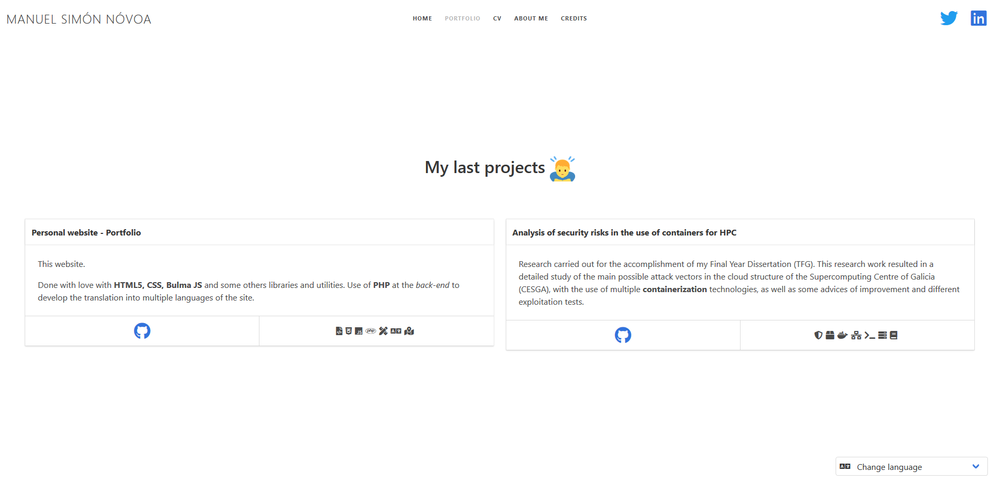
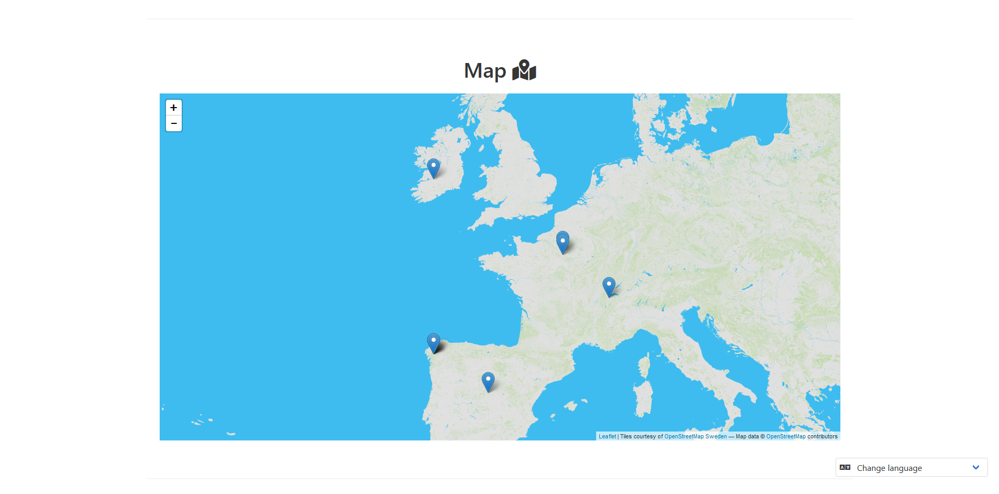
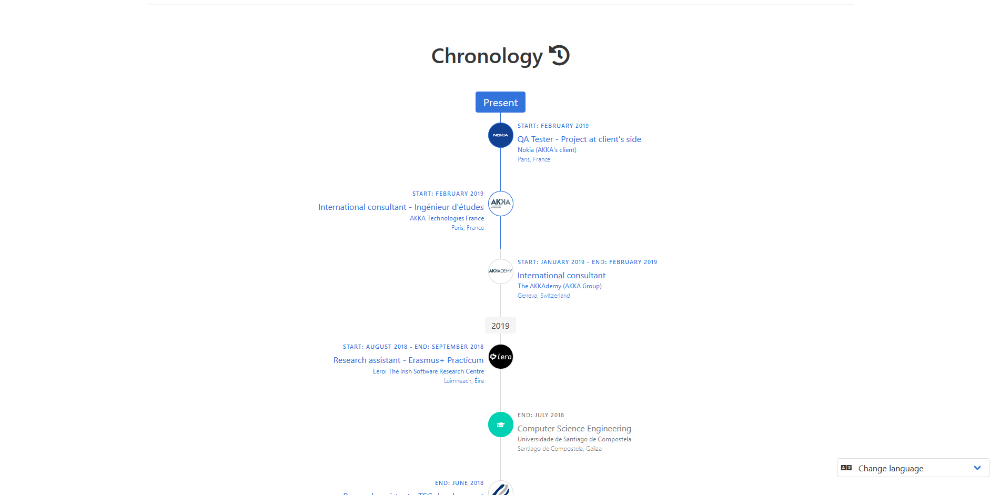
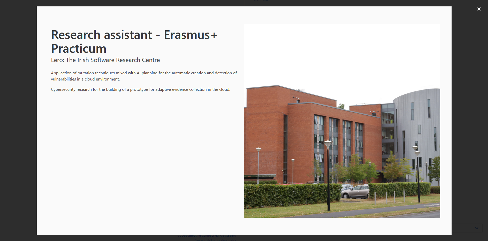
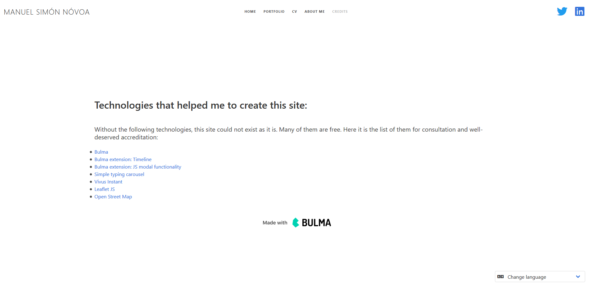

# Portfolio - My personal website

### https://manuel.gal

> **WARNING**: This repo was split into two branches in order to provide a STATIC version of the project (front-end only), and a "FULL" version (web aplication with back-end).
**Front-end** ready-to-go version is available at **MASTER** branch.
**Full web app**, using PHP in order to provide a multi-language site, it is available at **back-end branch**.
Check the corresponding Readme to learn how to launch the project.


> #portfolio #website #bulma #bulmaio #html #css #php #js #javascript #multilanguage

[](http://badges.mit-license.org)

My own website. Basically, it is an online portfolio where I write about my projects and proffesional path. Designed and developed by myself using Bulma.io among other technologies. Some features considered during the development of this projects were:

- **Multilanguage support**: The site is available in Portuguese (AGAL Galician), English, Spanish and French. Check the back-end branch if you want to know more about this.
- **Geolocalization** stuff: OpenStreet maps with a non-state layout.
- **Easily understandibility code** thanks to Bulma.io.
- **Mobile friendly**: The site gets adapted to mobile screens, so it presents a comfortable GUI from both desktop and mobile.

Feel free to fork this repo and create your own portfolio from here.

---

## Deployment

This is the static version of the project. Just open the **_index.html_** file with your favourite browser and you are ready to go! Nothing else. Simple.

Enjoy!

------

##  Index

- [Home](#home)
- [Portfolio](#portfolio)
- [CV](#cv)
- [About me](#about-me)
- [Credits](#credits)  

---

### Home


Some credits:
- Typing carousel from Gregory Schier: https://codepen.io/gschier/pen/jkivt
- Animations created with Vivus: https://maxwellito.github.io/vivus-instant/

**Easter egg**: animations change every time you enter the site thanks to a simple Javascript function I've made:
```javascript
<script type="text/javascript">  
	var svgs = new Array(6);  
	svgs[0] = "images/faro.svg";
	svgs[1] = "images/gaita.svg";  
	svgs[2] = "images/portatil.svg";
	svgs[3] = "images/triskele.svg";
	svgs[4] = "images/vieira.svg";
	svgs[5] = "images/chuva.svg";
	
	var random = Math.floor(Math.random() * svgs.length);
	document.getElementById("my-svg").data = svgs[random];
</script> 
```

---

### Portfolio



A simple and confortable page were to check some of the projects I've done.

---

### CV

Some credits:
- Maps thanks to: Leaflet JS (https://leafletjs.com/) and Open Street Map (https://www.openstreetmap.org/)

This section is structured in 2 clearly different parts:

##### Map



Geovisualization made easy at HTML thanks to Leaflet JS. Simply write this HTML tag and a map will be displayed depending on your own configurations (basically give a height at the style, so the map can be shown):

```html
<div id="map" class="map" style="z-index: 1"></div>
```

```css
#map {
    height: 70vh;
}
```

Map info and display settings wrote at a JS file available at: js/leaflet-map.js

```javascript
var map = L.map('map', {
			center: [48, -3],
			zoom: 5,
			zoomControl: true
		});

var defaultLayer = L.tileLayer.provider('Hydda.Base').addTo(map);

L.marker([42.8755536, -8.5532895]).addTo(map)
		.bindPopup('<p class="heading">qwert</p> <p class="heading">asdf</p> <b> <p>Content</p>');
.
.
.
```

##### Chronology





Made with the Bulma timeline extension (https://github.com/Wikiki/bulma-timeline) and Bulma modals.

> **WARNING**: As bulma does NOT include any Javascript content, it was necessary to write a simple JS function to get Bulma modals working.

Bulma modal javascript code (also available at js/modal.js):

```javascript
var refs = {
    open: function(a) { document.getElementById(a).classList.add('is-active');  },
    close:  function(a) { document.getElementById(a).classList.remove('is-active');   }
};
```


Some important indications at HTML files too:

- Calling modals from HTML:

```html
<div class="timeline-content" onclick="refs.open('modalID')">
    .
    .
    .
</div>
```

- Modifications at modal, to be able to close it and some style changes:

```html
<div class="modal" id="modalID">
    <div onclick="refs.close('name')" class="modal-background"></div>
    <div class="modal-content" style="width: 85%">
        <section class="hero has-background-white-bis is-fullheight-with-navbar">
            <div class="hero-body">
                .
                .
                .
            </div>
        </section>
    </div>
    <button class="modal-close is-large" aria-label="close" onclick="refs.close('modalID')"></button>
</div>
```

---

### About me

A simple page where to write a little bio and add some contact info.


---

### Credits

Without the technologies mentioned in this section, this project could not exist as it is. Many of them are free.



---

## License

[](http://badges.mit-license.org)
