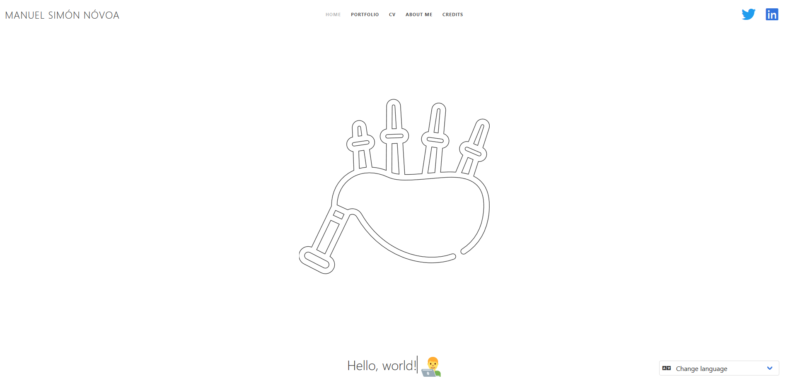

# Portfolio - My personal website

## https://manuel.gal

> **WARNING**: This brach is related to the **BACK-END** of this project. Anything else must be checked at the master brach. Ty!



> #portfolio #website #bulma #bulmaio #html #css #php #js #javascript #multilanguage

[](http://badges.mit-license.org)

In order to transform my static mono-language style into a web app that allows multi-language I used PHP at the back-ground. Here I'll explain some basics about how I did this.

<hr>

### Deployment

This is **now** a PHP project. The easiest way to get it working at your local machine is just launch the built-in server PHP includes in its latest versions:

```bash
cd path/to/the/app
php -S localhost:8000
```

Then, access it with your favorite browser.

<hr>

### Logic

Every single .html file is renamed into a .php one. Then, the following is added at the start of each file:

```php
<?php
include "config.php";
?>
```

That config.php file will allow the app to auto-detect the browser's language at the first visit and change the language shown in the page, even exchange if necessary. For that, an algorithm will detect the language and check if it is one of the accepted in the site (gl, pt, en, es, fr). If no language is in the array of accepted languages, pt will work as default.

The final language will be saved into a small session cookie:

```php
if (!isset($_SESSION['lang'])) {
    $acceptLang = ['gl', 'pt', 'en', 'es', 'fr'];

    $langArray = explode(',', $_SERVER['HTTP_ACCEPT_LANGUAGE']);
    $langFinal = 'pt';

    foreach ($langArray as $langAux){
        $lang = substr($langAux, 0, 2);
        if ($lang == 'gl') $lang='pt';
        if (in_array($lang, $acceptLang)){
            $langFinal = $lang;
            break;
        }
    }

    $_SESSION['lang'] = $langFinal;
}
```

In case we've already entered the site, but we want to exchanged the language, we will make use of the following:

```php
else if (isset($_GET['lang']) && $_SESSION['lang'] != $_GET['lang'] && !empty($_GET['lang'])) {
    if ($_GET['lang'] == "en")
        $_SESSION['lang'] = "en";
    else if ($_GET['lang'] == "pt")
        $_SESSION['lang'] = "pt";
    else if ($_GET['lang'] == "es")
        $_SESSION['lang'] = "es";
    else if ($_GET['lang'] == "fr")
        $_SESSION['lang'] = "fr";
}
```

Finally the corresponding language file will be requested:

```php
require_once "languages/" . $_SESSION['lang'] . ".php";
```

<hr>

### Translation files

As can be imagined, we will have one file per language, that is the one required in the previous step. They will follow a "key => content" structure as in this sample:

```php
<?php
	$lang = array(
        //Navbar
        "home" => "Home",
        "portfolio" => "Portfolio",
        "cv" => "CV",
        "about" => "About me",
        "credits" => "Credits",
	);
?>
```

HTML content may be included here, at the content field.

<hr>

### Changes at HTML (now PHP) files

In order to get the text changed, we must change every single text in the PHP files as the following example, so it can get substituted:

```php
<?php echo $lang['key'] ?>
```

